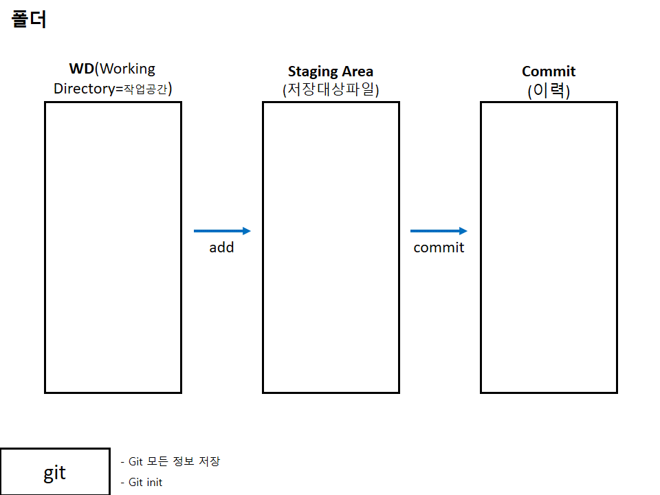

# Git 기초

## 0. 준비사항

* [git bash](https://gitforwindows.org/)
  * git을 활용하기 위한 CLI(Command Line Interface)
  * source tree, github desktop 등을 통해 GUI 환경에서도 활용 가능하다.


# 1. 로컬 저장소 활용하기

### 1. 저장소 초기화

```bash
$ git init
Initialized empty Git repository in C:/Users/student/Desktop/TIL/.git/
```


* 저장소(repository)를 초기화 하게 되면

  .git 폴더가 해당 디렉토리에 생성된다.

* bash 창에서는 (master)라고 표기 된다.

  * 현재 브랜치가 master라는 것을 의미함


### 2. add - staging area

> git으로 관리되는 파일들은 Woking Directory(작업환경), Staging Area, Commit 단계를 거쳐 이력에 저장된다.

```bash
$ git add a.txt # 파일명
$ git add images/ # 폴더명
$ git add . # 현재 디렉토리의 모든 파일 및 폴더
```


* add 전 상태

```bash
$ git status
On branch master

No commits yet

Untracked files:
  (use "git add <file>..." to include in what will be committed)
        git.md
        image/
        markdown.md

nothing added to commit but untracked files present (use "git add" to track)

```


* add 후 상태

```bash
$ git add .
$ git status
On branch master

No commits yet

Changes to be committed:
  (use "git rm --cached <file>..." to unstage)
        new file:   git.md
        new file:   image/5a51b0355f170db8148af68f266efb74.jpg
        new file:   markdown.md

```


### 3.  commit

> 커밋은 코드의 이력을 남기는 과정이다.(=확정짓다)


```bash
$ git commit -m '커밋 메세지'
[master (root-commit) cb1743c] 마크다운 및 git 기초 정리
 3 files changed, 133 insertions(+)
 create mode 100644 git.md
 create mode 100644 image/5a51b0355f170db8148af68f266efb74.jpg
 create mode 100644 markdown.md

```

* 커밋 메세지는 항상 해당 이력에 대한 정보를 담을 수 있도록 작성하는 것이 좋다.

* 일관적인 커밋 메세지를 작성하는 습관을 들이자.
* 이력 확인을 위해서는 아래의 명령어를 활용한다.

```bash
$ git log
commit cb1743ccf6a899132f2142ae88f211f7cefc5d92 (HEAD -> master)
Author: csy7489 <csy7489@naver.com>
Date:   Mon Dec 16 14:24:27 2019 +0900

    마크다운 및 git 기초 정리
```


**-항상 status 명령어를 통해 git의 상태를 확인하자! **

**-commit 이후에는 명령어를 통해 이력들을 확인하자!**


## 원격 저장소 활용하기

> 원격 저장소(remote repository)를 제공하는 서비스는 다양하게 존재한다.
>
> github를 기준으로 설명한다.


### 0. 준비하기

* Github에서 저장소(repository) 생성


### 1. 원격 저장소 설정

```bash
$ git remote add origin 'github url'
```

* {github url} 부분에는 원격 저장소 url을 작성한다.(repositoty 생성 후 주소 복사)
* 원격 저장소(remote)로 {github url}을 origin 이라는 이름으로 추가(add)하는 명령어이다.
* 원격 저장소 목록을 보기 위해서는 아래의 명령어를 활용한다.

```bash
$ git remote -v
origin  https://github.com/csy7489/TIL.git (fetch)
origin  https://github.com/csy7489/TIL.git (push)
```

* 저장소 삭제 명령

```bash
$ git remote rm origin
```


### 2. push

```bash
$ git push origin master
```

* 설정된 원격 저장소(origin)으로 push

폴더의 내용을 수정, 삭제 및 생성 등을 하게 된다면 add, commit, push 명령어를 통해서 이력을 저장하고 push 명령어를 통해 업로드 된다.


# Git 그림이해



 